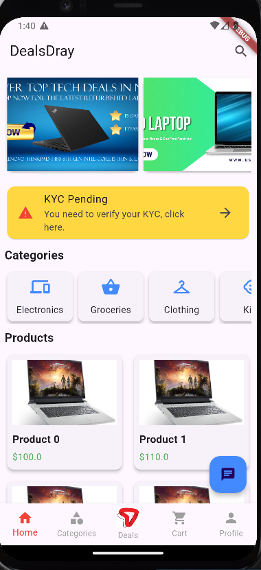
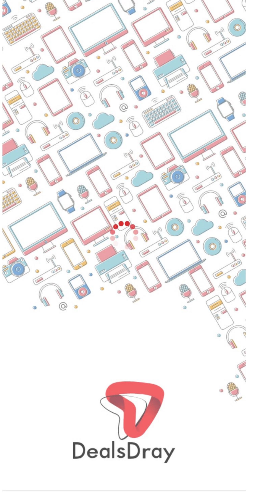

# DealsDray Shopping App

This is a **DealsDray Shopping App** built using **Flutter**. The app provides a seamless shopping experience with features like browsing products, viewing offers, completing KYC, adding items to the cart, and more.

## Demo Video

## Features

- **Splash Screen**: Displays the DealsDray logo and transitions to the login screen.
- **Login Screen**: Option to log in with email/password or phone number with OTP verification.
- **Home Screen**: Includes a search bar, product categories, featured offers, and a list of products.
- **Product Details Screen**: Shows product information and allows adding the product to the cart.
- **Cart**: Displays selected products and their total cost.
- **Profile, Offers, and Items Drawer Menu**: Allows navigation to user profile, view offers, and items.
- **Bottom Navigation Bar**: Provides quick access to Home, Categories, Deals, Cart, and Profile sections.
- **Floating Chat Button**: Enables in-app customer support via chat.

## Directory Structure
<!-- lib/
lib/
├── main.dart                       # Entry point of the Flutter app
├── screens/                        # Folder containing all the app screens
│   ├── splash_screen.dart          # Splash screen for the app
│   ├── login_screen.dart           # Login screen
│   ├── signup_screen.dart          # Sign-up screen (if you decide to implement it)
│   ├── home_screen.dart            # Home screen with product categories and featured deals
│   ├── product_details_screen.dart # Product details page
│   ├── cart_screen.dart            # Shopping cart screen
│   ├── checkout_screen.dart        # Checkout screen
├── widgets/                        # Reusable components folder
│   ├── category_card.dart          # Reusable widget for category cards in Home Screen
│   ├── product_card.dart           # Reusable widget for product cards
│   ├── custom_button.dart          # Custom button widget for reuse across screens
├── models/                         # Folder for app models/data classes (if required for data management)
│   ├── product_model.dart          # Product model class (optional for managing data)
├── services/                       # Business logic and API calls
│   ├── auth_service.dart           # Authentication services like login, sign-up
│   ├── cart_service.dart           # Business logic for handling cart actions
├── assets/                         # Folder for static resources (images, icons, etc.)
│   ├── dealsdray_logo.png          # Logo for the splash screen
│   ├── product_image.png           # Example product image
│   ├── electronics.png             # Category image (electronics)
│   ├── clothing.png                # Category image (clothing)
│   ├── groceries.png               # Category image (groceries)
├── utils/                          # Utility functions/helpers
│   ├── theme.dart                  # Theme-related settings for the app
│   ├── constants.dart              # App-wide constants like color codes, padding, etc.
├── providers/                      # State management (if you use Provider or other state management)
│   ├── cart_provider.dart          # State management for cart (if using Provider)

-->

## App Screenshots

