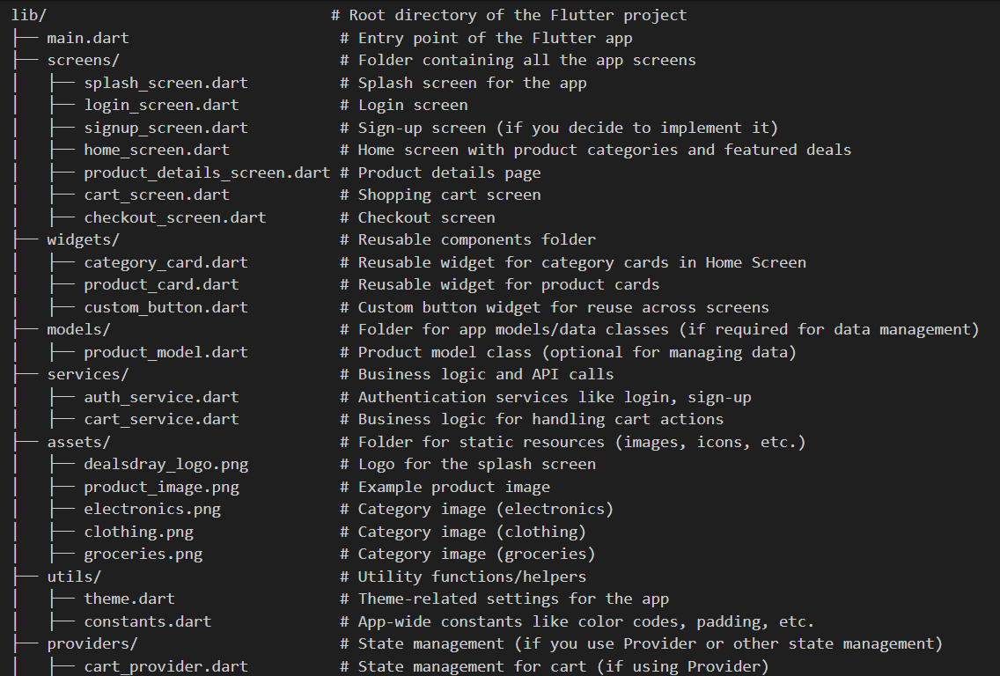

# DealsDray Shopping App

This is a **DealsDray Shopping App** built using **Flutter**. The app provides a seamless shopping experience with features like browsing products, viewing offers, completing KYC, adding items to the cart, and more.

## Demo Video

## Features

- **Splash Screen**: Displays the DealsDray logo and transitions to the login screen.
- **Login Screen**: Option to log in with email/password or phone number with OTP verification.
- **Home Screen**: Includes a search bar, product categories, featured offers, and a list of products.
- **Product Details Screen**: Shows product information and allows adding the product to the cart.
- **Cart**: Displays selected products and their total cost.
- **Profile, Offers, and Items Drawer Menu**: Allows navigation to user profile, view offers, and items.
- **Bottom Navigation Bar**: Provides quick access to Home, Categories, Deals, Cart, and Profile sections.
- **Floating Chat Button**: Enables in-app customer support via chat.

## Directory Structure

## App Screenshots

